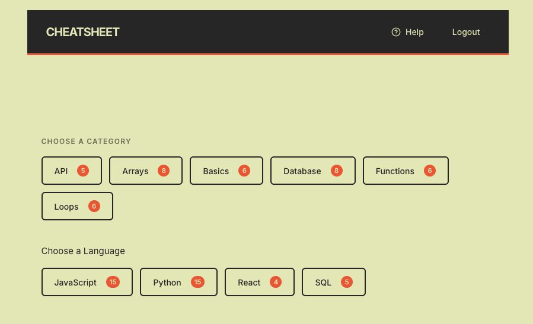
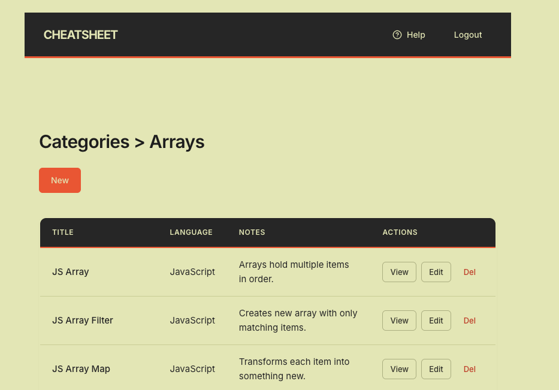

# cheatsheet_mvp
# CHEATSHEET

A full-stack code snippet manager for developers. Save, organize, and quickly access your most-used code snippets by language or category.




## Live Demo

[Demo Link] (https://github.com/josdic1/cheatsheet_mvp)

## Features

- **Dual Organization** — Browse snippets by programming language (Python, JavaScript, React, SQL) or by category (Basics, Arrays, Functions, Loops, API, Database)
- **Full CRUD** — Create, read, update, and delete code snippets
- **User Authentication** — Secure login/signup with session-based auth and password hashing
- **Built-in Help Guide** — In-app modal explains how to use the app in 3 simple steps
- **Badge Counts** — See how many snippets are in each category/language at a glance
- **Clean UI** — Minimal, responsive design with smooth bouncy animations
- **Alphabetical Sorting** — Snippets and categories automatically sorted A-Z

## Tech Stack

### Frontend
- React 18
- React Router v6
- Vite
- Lucide React (icons)
- Custom CSS (Tailwind-inspired)

### Backend
- Python / Flask
- SQLAlchemy ORM
- Flask-Migrate (Alembic)
- Flask-Bcrypt (password hashing)
- Flask-CORS
- SQLite (development) / PostgreSQL (production)

## Database Schema

```
┌─────────────┐       ┌─────────────┐       ┌─────────────┐
│    User     │       │    Cheat    │       │  Language   │
├─────────────┤       ├─────────────┤       ├─────────────┤
│ id          │───┐   │ id          │   ┌───│ id          │
│ name        │   │   │ title       │   │   │ name        │
│ email       │   │   │ code        │   │   └─────────────┘
│ password    │   │   │ notes       │   │
└─────────────┘   └──►│ user_id     │   │   ┌─────────────┐
                      │ language_id │◄──┘   │  Category   │
                      │ category_id │◄──────├─────────────┤
                      │ created_at  │       │ id          │
                      │ updated_at  │       │ name        │
                      └─────────────┘       └─────────────┘
```

### Relationships
- User has many Cheats (one-to-many)
- Language has many Cheats (one-to-many)
- Category has many Cheats (one-to-many)
- Cheat belongs to User, Language, and Category

## Installation

### Prerequisites
- Python 3.10+
- Node.js 18+
- npm or yarn

### Backend Setup

```bash
# Navigate to server directory
cd server

# Create virtual environment
python -m venv venv
source venv/bin/activate  # On Windows: venv\Scripts\activate

# Install dependencies
pip install -r requirements.txt

# Initialize database
flask db init
flask db migrate -m "initial migration"
flask db upgrade

# Seed database (optional)
python seed.py

# Start server
python run.py
```

Server runs at `http://localhost:5555`

### Frontend Setup

```bash
# Navigate to client directory
cd client

# Install dependencies
npm install

# Start development server
npm run dev
```

Client runs at `http://localhost:5173`

## API Endpoints

### Authentication
| Method | Endpoint | Description |
|--------|----------|-------------|
| POST | `/api/signup` | Create new user |
| POST | `/api/login` | Login user |
| POST | `/api/logout` | Logout user |
| GET | `/api/check_session` | Verify session |

### Cheats
| Method | Endpoint | Description |
|--------|----------|-------------|
| GET | `/api/cheats` | Get all cheats |
| POST | `/api/cheats` | Create cheat |
| GET | `/api/cheats/:id` | Get single cheat |
| PATCH | `/api/cheats/:id` | Update cheat |
| DELETE | `/api/cheats/:id` | Delete cheat |

### Languages & Categories
| Method | Endpoint | Description |
|--------|----------|-------------|
| GET | `/api/languages` | Get all languages |
| GET | `/api/categories` | Get all categories |

## Project Structure

```
cheatsheet_mvp/
├── client/
│   ├── src/
│   │   ├── components/
│   │   │   ├── NavBar.jsx          # Navigation with Help modal
│   │   │   ├── CategoryCheatForm.jsx
│   │   │   └── LanguageCheatForm.jsx
│   │   ├── contexts/
│   │   │   └── AuthContext.jsx
│   │   ├── hooks/
│   │   │   └── useAuth.js
│   │   ├── pages/
│   │   │   ├── HomePage.jsx        # Category/Language selection
│   │   │   ├── LoginPage.jsx
│   │   │   ├── SignupPage.jsx
│   │   │   ├── CategoryCheatsPage.jsx
│   │   │   ├── LanguageCheatsPage.jsx
│   │   │   └── ErrorPage.jsx
│   │   ├── App.jsx
│   │   ├── routes.jsx
│   │   ├── main.jsx
│   │   └── index.css
│   ├── index.html
│   ├── package.json
│   └── vite.config.js
│
├── server/
│   ├── app.py
│   ├── models.py
│   ├── config.py
│   ├── extensions.py
│   ├── run.py
│   ├── seed.py
│   └── requirements.txt
│
└── README.md
```

## Usage

1. **Sign Up / Login** — Create an account or login with existing credentials
2. **Browse** — Click a Language or Category button on the home page
3. **View Snippets** — See all cheats in that group, alphabetically sorted
4. **Add New** — Click "New" to create a snippet with title, code, notes, and tags
5. **Edit / Delete** — Manage your snippets from the table view

## Validations

### Backend (SQLAlchemy)
- User email must be unique and valid format
- User password minimum 4 characters
- Cheat title is required and unique
- Cheat must have associated user, language, and category

### Frontend (React)
- All form fields validated before submission
- Protected routes redirect unauthenticated users to login

## Future Enhancements

- [ ] Search/filter functionality
- [ ] Copy to clipboard button
- [ ] Syntax highlighting by language
- [ ] Tags for additional organization
- [ ] Share snippets publicly
- [ ] Import/export snippets
- [ ] Dark mode toggle

## Contributing

1. Fork the repository
2. Create a feature branch (`git checkout -b feature/new-feature`)
3. Commit changes (`git commit -m 'Add new feature'`)
4. Push to branch (`git push origin feature/new-feature`)
5. Open a Pull Request

## License

MIT License — feel free to use this project for learning or personal use.

## Author

**Josh Dicker**

- GitHub: [@josdic1](https://github.com/josdic1)
- Repository: [cheatsheet_mvp](https://github.com/josdic1/cheatsheet_mvp)

---

*Built as a Phase 5 capstone project for Flatiron School Software Engineering Bootcamp.*